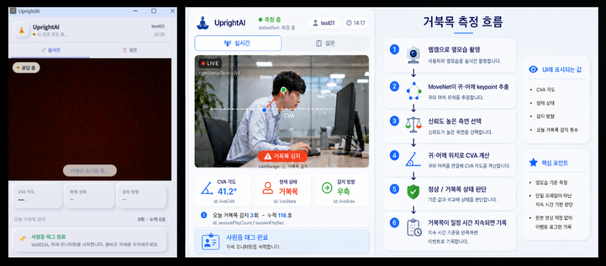
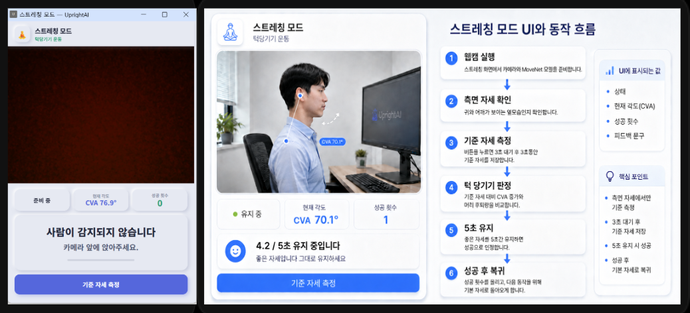
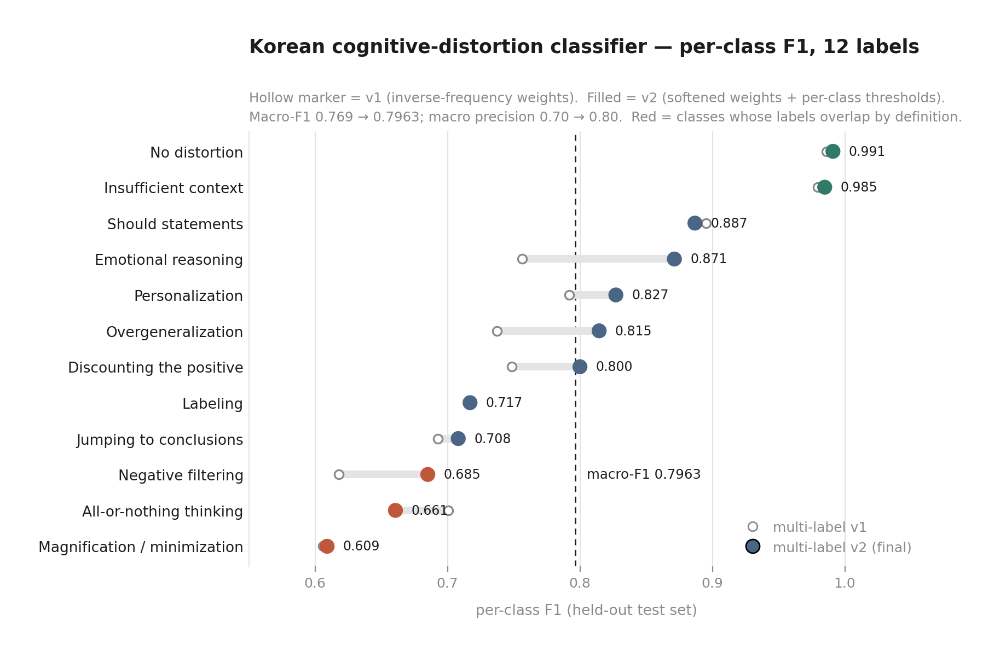
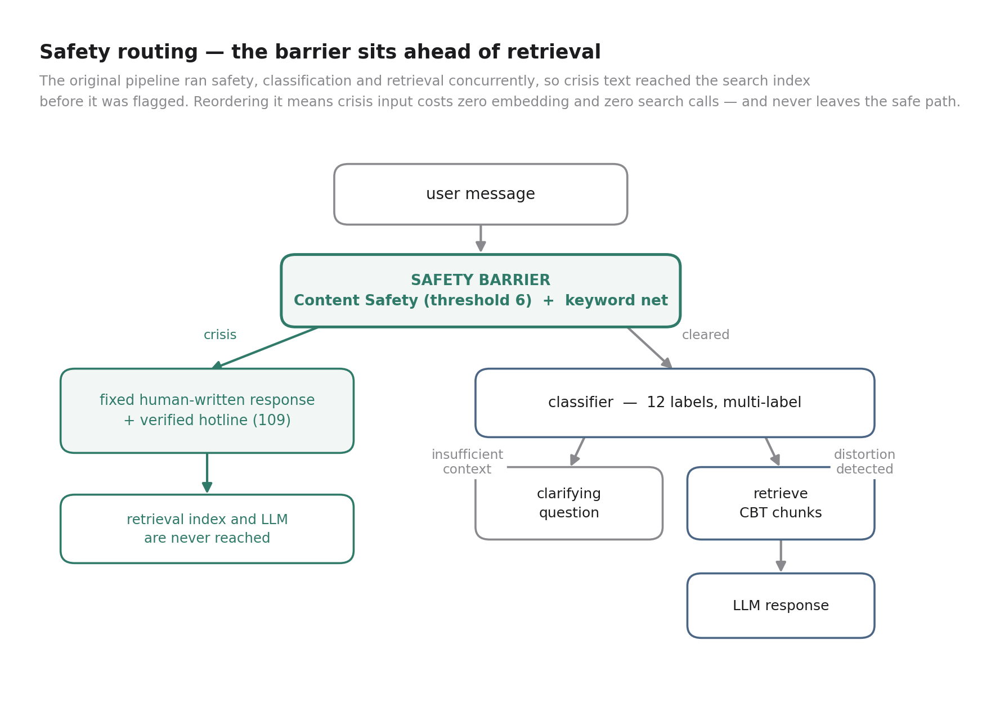
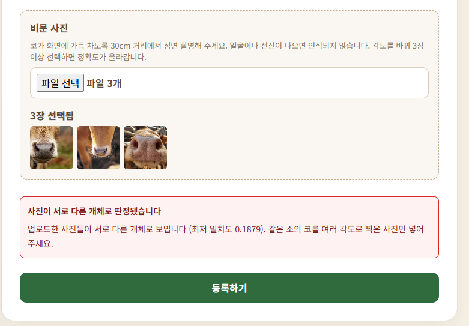
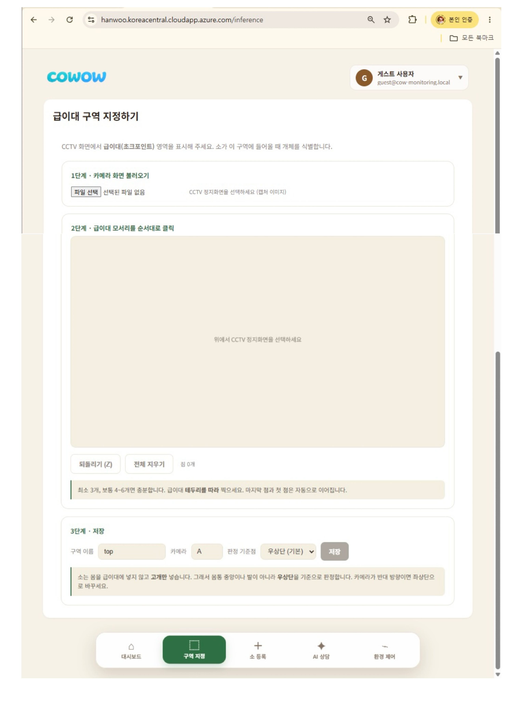

# Yeri Choi — Selected Projects

Incoming M.S. student, Sport Management, University of Florida (Spring 2027).
B.S. in Sports Sciences, with coursework in sport marketing and consumer psychology. I build systems that sense everyday behavior and act on it in real time — on-device inference, cloud pipelines, and the evaluation harnesses that tell you when they fail.

The three projects below were built during Microsoft AI School, an intensive Azure-based AI development program. I led all three teams.

**Research interest** — sport consumer behavior and health behavior change, studied with sensors rather than self-report: wearable and on-device measurement of everyday movement, and real-time intervention built on top of it.

📫 yeri17choi@gmail.com · [GitHub](https://github.com/yeriichoii) · [LinkedIn](www.linkedin.com/in/yerichoi2003)

---

### UprightAI — Real-time Posture Intervention in the Browser
> A Chrome extension that detects forward head posture from a webcam in real time and triggers a corrective stretching session before the user leaves the desk.

**What it does** — Runs MoveNet in the browser to extract ear and shoulder keypoints from a side-view webcam feed and computes craniovertebral angle (CVA) on-device. When CVA stays below a literature-based threshold (53°, with 3° hysteresis) for 10+ seconds, the system logs an event and later launches a chin-tuck stretching mode calibrated to that user's own baseline posture. Only anonymized angle and timestamp logs leave the device, batched to the cloud once per minute; no video is transmitted or stored.

**My role** — Team of 4 (team lead). I designed and built the on-device detection pipeline in the Chrome extension (MoveNet keypoint extraction, CVA computation, and the post-processing layer for temporal smoothing, hysteresis, and duration tracking), the NFC-to-Flask trigger that starts a session without manual input, and the serverless backend — Azure Functions with JWT auth, Cosmos DB log storage, and Application Insights instrumentation for end-to-end request tracing.

**Stack** — TensorFlow.js (MoveNet), Chrome Extension MV3, React + Vite, Flask, Azure Functions (Node.js), Cosmos DB, Application Insights, JWT/SHA-256 auth

**Result** — 23.1 ms per-frame on-device inference (GPU backend), ~50× faster than the CPU baseline — fast enough to hold a continuous detection loop on a laptop without a dedicated sensor.

---

### 마음갈피 (Maeum Galpi) — Cognitive-Distortion Classification & Safety Routing
> A Korean chat service that helps people notice and work through their own cognitive distortions. My work on it: a 12-label distortion classifier, a voice interface, and the safety barrier that keeps crisis text out of the retrieval path.

**What it does** — A user says or writes how they feel; a fine-tuned Korean classifier tags the message across 12 labels (10 distortion types, plus "no distortion" and "insufficient context") and routes it, returning a CBT-grounded reply that names the distortion rather than simply reassuring. Speech input and output are supported, so the service can be used aloud instead of typed — the interaction mode that matters when someone is distressed and not at a keyboard. Crisis input is caught before anything else and answered with fixed, human-written text and verified hotline information — the retrieval index and the LLM are never reached on that path.

**My role** — Team of 4 (team lead). I trained the classifier and built the dataset pipeline, designed the RAG corpus schema, rewrote the backend, and built the speech layer — STT with confidence-threshold reconfirmation, and TTS with SSML prosody tuning so the delivery does not read as clinical. **My classifier was not the one the team shipped** — after comparison they adopted a teammate's RoBERTa-large model. What I report below is my own measured work, and the reasoning that outlasts the model choice.

**Selected decisions**
- Moved the crisis-safety barrier ahead of retrieval. The existing code ran safety, classification and retrieval concurrently, so crisis text was already hitting the search index before it was flagged.
- Raised the Content Safety threshold from 2 to 6 after finding that ordinary distress ("nothing works out lately and it all feels like my fault") was being flagged as self-harm. In a mental-health application, expressed distress *is* the normal input; a keyword layer was kept underneath so genuine crisis phrasing still triggers.
- Found the crisis hotline hardcoded as a number retired in January 2024, and replaced it with the current one. A safety feature that dials a dead number is not a safety feature.
- Left prompt and response bodies out of the telemetry traces. The Azure Monitor OpenTelemetry SDK offers content capture as a switch; a mental-health app should not be writing user text into a monitoring store.
- Replaced the training dataset after finding the original was licensed non-commercial, which would not survive the project's commercialization criterion.

**Result** — Single-label macro-F1 0.8938; multi-label v2 macro-F1 0.7963 across 12 classes. The path between them is the finding: switching to multi-label (36.2% of training rows carried two or more distortions) collapsed precision to 0.49–0.65, which I traced to inverse-frequency weights reaching 19.65 and over-predicting positives. Softening the weights and tuning per-class thresholds brought macro precision from 0.70 to 0.80 and macro-F1 from 0.769 to 0.7963. Two classes stayed weak (0.66, 0.61); reading the false negatives showed the labels themselves overlapped, so I documented it as a label-definition problem rather than tuning further.

**Stack** — PyTorch, HuggingFace Transformers (KcELECTRA), FastAPI, Azure OpenAI, Azure AI Search, Azure AI Content Safety, Azure Speech, Application Insights (Azure Monitor OpenTelemetry)

---

### CoWow — Individual Cattle Behavior Early-Warning System
> Identifies individual animals from existing barn CCTV and builds a per-individual behavior timeline that flags deviation from that animal's own baseline.

**What it does** — Turns CCTV a farm already owns into individual-level health monitoring, with no per-animal wearable sensor. Animals are enrolled from both nose-print (muzzle) photos and ear-tag numbers, then re-identified at feeder and water chokepoints by running muzzle matching and ear-tag OCR together, so the two paths cross-check each other rather than resting on one biometric. The chokepoints are drawn by the operator on their own camera view rather than inferred, which is what lets the system work in a barn of any layout without retraining anything. Every prior tracking observation is then retroactively bound to that animal, so a continuous per-individual time series can be built. When identification confidence is low the system withholds an ID instead of guessing — a mislabeled observation would corrupt two animals' baselines at once.

**My role** — Team of 6 (team lead). I designed and built the entire individual-identification subsystem: the muzzle recognition model (EfficientNet-B0 + ArcFace, 512-d embeddings, open-set), the muzzle detection-and-crop pipeline that feeds it, the ear-tag OCR path that cross-checks it, the FastAPI + pgvector identification service running in production on Azure, the identity back-propagation schema that retroactively links tracking IDs to individuals without rewriting history, the operator-facing zone-drawing UI, and the open-set / degradation evaluation harness.

**Stack** — PyTorch, ArcFace, ONNX Runtime, YOLO-World, ByteTrack, FastAPI, PostgreSQL + pgvector, Azure VM (T4), Caddy

**Result** — Closed-set rank-1 identification of 0.9921 on 67 individuals held out at the animal level (never seen during training, n=1,017 probes). Under a full open-set protocol — the only one that can measure false identification — performance is far lower and I report it as such: on self-recorded barn footage (5 enrolled animals, 30 genuine and 30 impostor probes) the operating point is DIR@rank1 0.333 at FPIR 0.067 (threshold 0.70), with 0 misassignments out of 30. The gap between those two numbers, not the higher one, is the finding: the system is tuned to withhold an ID rather than guess, because a single mislabeled observation corrupts two animals' baselines at once. Cross-domain transfer is the open problem — rank-1 misidentification degrades sharply on a different capture domain, and closing that gap needs Hanwoo field data at scale, which was not obtainable within the project period.

---

### Background

B.S. in Sports Sciences (first in major, early graduation), with coursework concentrated in sport marketing, psychology, nutrition, and management.

For a research methods and capstone sequence I designed the study I actually wanted to run: whether character-collaboration pop-up stores, used as a sport marketing vehicle, shape not only purchase intention but **exercise participation intention** alongside spectatorship intention. The question I cared about was whether a marketing stimulus could move a person's body, not just their wallet.

No faculty member at my institution worked on that question. Rather than wait for an advisor who did not exist, I chose to learn the method where the method was: I joined a lab whose topic I could genuinely contribute to, and wrote my undergraduate thesis on volunteering behavior — peer-reviewed and published.

The projects above are where the original question went next. Instead of measuring behavioral intention by self-report, measure the behavior itself — continuously, on-device, and in the settings where it actually happens.
